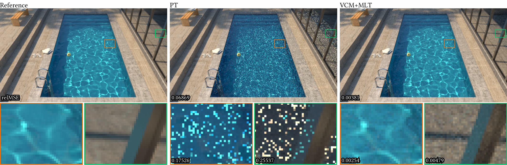

# Figure Generator

[figuregen](https://github.com/Mira-13/figure-gen) is an awesome figure generator created by Mira Niemann and Pascal Grittmann. 

This fork modifies the pdf backend to add support for outlining text, which is sometimes more useful than highlighting the entire text block. Check out ``examples\vertical_stack.py`` for an example.

Support is not implemented for the other backends, but contributions are welcome.


## Dependencies

Mandatory:
- Python 3.11+ with opencv-python, simpleimageio, and texsnip

Optional:
- For the .pdf backend: pdflatex (in path) with at least: tikz, calc, standalone, fontenc, libertine, inputenc.
- For the .pptx backend: python-pptx
- To include pdf files as image data: PyPDF2, and pdf2image ([which requires poppler](https://pypi.org/project/pdf2image/)).

## Quickstart

You can install the figure generator and all mandatory dependencies with a simple:

```
python -m pip install figuregen
```

The fastest way to get a first figure is by using an existing template:

```Python
import simpleimageio as sio
import figuregen
from figuregen.util.templates import CropComparison
from figuregen.util.image import Cropbox

figure = CropComparison(
    reference_image=sio.read("images/pool/pool.exr"),
    method_images=[
        sio.read("images/pool/pool-60s-path.exr"),
        sio.read("images/pool/pool-60s-upsmcmc.exr"),
        sio.read("images/pool/pool-60s-radiance.exr"),
        sio.read("images/pool/pool-60s-full.exr"),
    ],
    crops=[
        Cropbox(top=100, left=200, height=96, width=128, scale=5),
        Cropbox(top=100, left=450, height=96, width=128, scale=5),
    ],
    scene_name="Pool",
    method_names=["Reference", "Path Tracer", "UPS+MCMC", "Radiance-based", "Ours"]
)

# here you can modify the figure layout and data
# ...

# Generate the figure with the pdflatex backend and default settings
figuregen.figure([figure.figure_row], width_cm=17.7, filename="pool_with_template.pdf")
```


The template simply creates a list of `Grid` objects that can be modified and extended arbitrarily before passing it to the `figure()` function.

Examples and inspiration for creating your own figure layouts can be found in [our examples](examples) or the [Jupyter tutorial](Tutorial.ipynb).

## Examples

Clicking on an image below leads to the test that created the corresponding figure.

### Vertical stacks
[](examples/vertical_stack.py)

### Split Comparison
[](examples/split_comparison.py)

### Crop Comparison
[](examples/siggraph_example.py)

### Plots
[](examples/plotgrid.py)

### Grid with titles, labels, markers, and frames
[](examples/single_module.py)
